# 🧠 Praktikum Machine Learning

<p align="center">
  
  
  
  
</p>

<p align="center">
  Kumpulan <b>13 bab praktikum Machine Learning</b> — dari konsep dasar hingga Convolutional Neural Network —<br>
  dalam bentuk notebook Python yang <b>sudah dieksekusi</b>: lengkap dengan <b>output, visualisasi, dan penjelasan</b> tiap langkah.
</p>

<p align="center">
  <a href="#-peta-belajar">🗺️ Peta Belajar</a> •
  <a href="#-daftar-bab">📚 Daftar Bab</a> •
  <a href="#-temuan-menarik">🔬 Temuan Menarik</a> •
  <a href="#-cara-menjalankan">🚀 Cara Menjalankan</a> •
  <a href="#-modul-pdf">📄 Modul PDF</a>
</p>

---

## 🗺️ Peta Belajar

```mermaid
flowchart LR
    A["<b>Bab 1</b><br/>Konsep Dasar ML"] --> B["<b>Bab 2</b><br/>Workflow &<br/>CRISP-DM"]
    B --> C["<b>Bab 3</b><br/>Data<br/>Preparation"]
    C --> D["<b>Bab 4</b><br/>Feature<br/>Engineering"]
    D --> E["<b>Bab 5</b><br/>Decision<br/>Tree"]
    E --> F["<b>Bab 6</b><br/>KNN &<br/>Naive Bayes"]
    F --> G["<b>Bab 7</b><br/>Evaluasi<br/>Model"]
    G --> H["<b>Bab 8</b><br/>SVM"]
    H --> I["<b>Bab 9</b><br/>Ensemble<br/>Methods"]
    I --> J["<b>Bab 10</b><br/>Clustering"]
    J --> K["<b>Bab 11</b><br/>PCA &<br/>Reduksi Dimensi"]
    K --> L["<b>Bab 12</b><br/>Neural<br/>Networks"]
    L --> M["<b>Bab 13</b><br/>CNN"]
    M --> N["<b>Bab 14</b><br/>Mini Project<br/>End-to-End ✅"]

    style A fill:#0f2a4a,color:#fff
    style G fill:#d4a017,color:#fff
    style M fill:#7c3aed,color:#fff
    style N fill:#e5e7eb,color:#666
```



> **Alur yang disarankan:** ikuti bab berurutan 1 → 13. Bab 7 (Evaluasi Model) adalah fondasi untuk memahami semua eksperimen perbandingan di bab-bab berikutnya.

---

## 📚 Daftar Bab

Setiap bab berisi tiga hal: **`praktikum-bab-NN.ipynb`** (notebook siap jalan) · **`praktikum-bab-NN.pdf`** (modul PDF) · **`README.md`** (panduan bab). Klik untuk melihat eksperimen di tiap bab 👇

<details>
<summary><b>Bab 1 — Konsep Dasar Machine Learning</b> <code>Iris + KNN</code></summary>

Alur end-to-end ML paling sederhana: definisi ML (Mitchell), tiga kategori ML, lalu praktik memuat dataset Iris → split → latih KNN → evaluasi → visualisasi.

- **Percobaan 1:** pengaruh nilai `k` pada KNN — k=1 overfitting (train 100%, test turun), k=3 & k=5 optimal
- **Percobaan 2:** pengaruh `test_size` — porsi uji lebih besar memberi gambaran performa lebih stabil
- **Percobaan 3:** visualisasi decision boundary k=3 vs k=30 — k besar membuat batas keputusan lebih halus

📁 `bab-01-konsep-dasar-machine-learning/`
</details>

<details>
<summary><b>Bab 2 — Workflow CRISP-DM, Bias & Variance</b> <code>Telco Churn</code></summary>

Memetakan proyek nyata ke tahapan CRISP-DM dan mendiagnosis bias-variance lewat kurva learning.

- **Latihan 1:** pemetaan kasus Telco Customer Churn ke 6 fase CRISP-DM
- **Latihan 2:** diagnosis bias-variance — model underfit vs overfit dari gap train/validation
- **Mandiri:** split dengan vs tanpa stratify · Decision Tree vs Logistic Regression · efek `class_weight="balanced"`

📁 `bab-02-workflow-crisp-dm-bias-variance/`
</details>

<details>
<summary><b>Bab 3 — Data Preparation</b> <code>Missing Values · Outlier · Imbalanced Data</code></summary>

Menangani tiga masalah data paling umum sebelum modeling.

- **Latihan 1:** Mean Imputation vs KNN Imputer — KNN Imputer menang (F1 0,308 vs 0,296) karena memakai pola antar-fitur
- **Latihan 2:** SMOTE vs undersampling vs `class_weight` pada data imbalance
- **Mandiri:** pengaruh `contamination` IsolationForest · SMOTE `k_neighbors` 5 vs 3 · buang outlier vs tidak

📁 `bab-03-data-preparation/`
</details>

<details>
<summary><b>Bab 4 — Feature Engineering & Pipeline</b> <code>Titanic · Breast Cancer</code></summary>

Konstruksi & seleksi fitur, lalu membungkus semuanya dalam Pipeline scikit-learn yang rapi.

- **Praktikum 1:** Filter (SelectKBest/chi²) vs Wrapper (RFE) vs Embedded (L1) — tiga filosofi seleksi fitur
- **Praktikum 2:** pipeline lengkap pada dataset Titanic (imputasi → encoding → scaling → model)
- **Mandiri:** pipeline vs preprocessing manual · dengan vs tanpa feature construction · `n_estimators` 50 vs 200

📁 `bab-04-feature-engineering-pipeline/`
</details>

<details>
<summary><b>Bab 5 — Decision Tree & Pruning</b> <code>Breast Cancer</code></summary>

Cara kerja CART/ID3 dan cara menjinakkan pohon yang overfitting lewat pruning.

- **Latihan 1:** pre-pruning — menyetel `max_depth`, `min_samples_leaf` sebelum training
- **Latihan 2:** cost complexity pruning path — mencari `ccp_alpha` optimal dari kurva
- **Mandiri:** kurva validasi manual `max_depth` 1–10 · `min_samples_leaf` 1 vs 20 · Decision Tree vs Random Forest kecil

📁 `bab-05-decision-tree-pruning/`
</details>

<details>
<summary><b>Bab 6 — KNN & Naive Bayes</b> <code>Breast Cancer · Klasifikasi Teks Spam</code></summary>

Dua algoritma klasik yang sederhana tapi kuat, termasuk penerapannya pada teks.

- **Praktikum 1:** KNN vs Naive Bayes pada data tabular
- **Praktikum 2:** klasifikasi teks spam dengan MultinomialNB (CountVectorizer)
- **Mandiri:** pengaruh nilai `k` · weights `uniform` vs `distance` · GaussianNB vs MultinomialNB pada data count

📁 `bab-06-knn-naive-bayes/`
</details>

<details>
<summary><b>Bab 7 — Evaluasi Model</b> <code>Confusion Matrix · ROC-AUC · Cross-Validation</code></summary>

Fondasi pengukuran performa: metrik klasifikasi yang tepat dan validasi yang andal.

- **Praktikum 1:** laporan evaluasi lengkap (precision, recall, F1, ROC-AUC, PR curve)
- **Praktikum 2:** perbandingan 3 model dengan Stratified k-Fold CV
- **Mandiri:** single split vs cross-validation · pengaruh `random_state` · akurasi vs F1 di data imbalance

📁 `bab-07-evaluasi-model/`
</details>

<details>
<summary><b>Bab 8 — Support Vector Machine</b> <code>Breast Cancer</code></summary>

Hyperplane, margin, dan kernel trick — plus satu pelajaran penting tentang scaling.

- **Praktikum 1:** perbandingan kernel linear vs poly vs RBF (RBF menang: 0,982)
- **Praktikum 2:** visualisasi decision boundary 2 fitur
- **Mandiri:** C kecil vs C besar · linear vs RBF di data non-linear · **dengan vs tanpa scaling** (0,947 → 0,982 — scaling itu wajib untuk SVM!)

📁 `bab-08-support-vector-machine/`
</details>

<details>
<summary><b>Bab 9 — Ensemble Methods</b> <code>Random Forest · Boosting · Voting</code></summary>

Menggabungkan banyak model lemah menjadi satu model kuat.

- **Praktikum 1:** pengaruh `n_estimators` pada Random Forest
- **Praktikum 2:** perbandingan 4 model (Tree, RF, Gradient Boosting, Voting)
- **Mandiri:** ensemble vs single tree di data noisy · pengaruh learning rate di Gradient Boosting · hard voting vs soft voting

📁 `bab-09-ensemble-methods/`
</details>

<details>
<summary><b>Bab 10 — Clustering</b> <code>K-Means · Hierarchical · DBSCAN</code></summary>

Unsupervised learning: menemukan struktur kelompok tanpa label.

- **Praktikum 1:** menentukan k optimal (elbow method + silhouette score)
- **Praktikum 2:** segmentasi dengan tiga algoritma — kapan memakai yang mana
- **Mandiri:** inisialisasi `random` vs `k-means++` · dengan vs tanpa scaling (wajib!) · sensitivitas DBSCAN terhadap `eps`

📁 `bab-10-clustering/`
</details>

<details>
<summary><b>Bab 11 — PCA & Reduksi Dimensi</b> <code>Wine · Digits</code></summary>

Memampatkan dimensi tanpa kehilangan informasi penting.

- **Praktikum 1:** kompresi dimensi dengan PCA — berapa komponen yang cukup?
- **Praktikum 2:** PCA vs t-SNE vs LDA — reduksi untuk kompresi vs visualisasi vs klasifikasi
- **Mandiri:** scree plot & varians kumulatif · PCA sebelum KNN (akurasi vs kecepatan) · visualisasi 2D fitur mentah vs komponen PCA

📁 `bab-11-pca-reduksi-dimensi/`
</details>

<details>
<summary><b>Bab 12 — Neural Networks (MLP)</b> <code>Digits 8×8</code></summary>

Masuk ke deep learning: Multi-Layer Perceptron dan cara melatihnya dengan benar.

- **Praktikum 1:** eksperimen arsitektur MLP (jumlah layer & neuron)
- **Praktikum 2:** early stopping — menghentikan training tepat waktu
- **Mandiri:** jumlah hidden layer · fungsi aktivasi (relu vs tanh vs logistic) · learning rate & optimizer (adam vs sgd)

📁 `bab-12-neural-networks/`
</details>

<details>
<summary><b>Bab 13 — Convolutional Neural Networks</b> <code>CIFAR-10</code></summary>

CNN untuk visi komputer: dari membangun sendiri hingga transfer learning.

- **Praktikum 1:** CNN sederhana dari nol (konvolusi → pooling → dense)
- **Praktikum 2:** CNN dari nol vs transfer learning — seberapa besar bedanya?
- **Mandiri:** data augmentation vs tanpa · jumlah filter 16 vs 32 · dropout 0 vs 0,5

📁 `bab-13-convolutional-neural-networks/`
</details>

<details>
<summary><b>Bab 14 — Mini Project End-to-End: Prediksi Penyakit Jantung</b> ✅</summary>

Proyek utama: ML end-to-end mengikuti 6 fase CRISP-DM dengan dataset Heart Disease UCI.

- **Praktikum 1:** EDA — distribusi umur, sebaran target, heatmap korelasi
- **Praktikum 2:** Data preparation — split stratified + scaling via Pipeline
- **Praktikum 3:** Feature engineering — `age_group` + `bp_chol_ratio`
- **Praktikum 4:** 3 algoritma + GridSearchCV (LogReg, Random Forest, SVM-RBF)
- **Praktikum 5:** Evaluasi 5 metrik + pemilihan model via **recall** (kasus medis)
- **Praktikum 6:** Deployment — web Flask (bukan Streamlit) + bot Telegram ([repo terpisah](https://github.com/dandienter/heart-disease-predictor))
- **Mandiri:** pentingnya scaling · Gradient Boosting ke-4 · pengaruh feature engineering

**Hasil:** SVM-RBF menang — akurasi 86,7% · recall 78,6% · F1 84,6% · ROC-AUC 95,7%

📁 `bab-14-mini-project-end-to-end/`
</details>

---

## 🔬 Temuan Menarik

Hal-hal yang terbukti dari eksperimen di repo ini (bukan sekadar teori):

| # | Temuan | Bab |
|---|--------|-----|
| 1 | KNN Imputer mengungguli mean imputation (F1 0,308 vs 0,296) karena memanfaatkan pola antar-fitur | 3 |
| 2 | SVM **wajib** scaling — akurasi naik 0,947 → 0,982 setelah StandardScaler | 8 |
| 3 | k=1 pada KNN menghafal data (train 100%) tapi gagal generalisasi — overfitting klasik | 1 |
| 4 | k besar (k=30) membuat decision boundary terlalu halus — underfitting | 1 |
| 5 | F1-score lebih jujur daripada akurasi pada data imbalance | 7 |
| 6 | Stratified k-Fold memberi estimasi performa lebih stabil daripada single split | 7 |
| 7 | `k-means++` jauh lebih stabil daripada inisialisasi random pada K-Means | 10 |
| 8 | Data augmentation meningkatkan generalisasi CNN tanpa data tambahan | 13 |
| 9 | Dropout 0,5 menekan overfitting pada CNN kecil | 13 |
| 10 | Early stopping menghentikan training tepat sebelum overfit | 12 |

---

## 📊 Sumber Data

<details>
<summary>Klik untuk melihat semua dataset yang dipakai</summary>

| Dataset | Sumber | Dipakai di |
|---|---|---|
| Iris (150 sampel, 4 fitur, 3 spesies) | `sklearn.datasets.load_iris` | Bab 1 |
| Telco Customer Churn (7043 pelanggan) | Kaggle | Bab 2 |
| Dataset sintetis klasifikasi (1000 sampel, imbalance 0.8/0.2) | `sklearn.datasets.make_classification` | Bab 2 |
| Dataset sintetis (2000 sampel, imbalance 0.95/0.05, missing 5%) | `sklearn.datasets.make_classification` | Bab 3 |
| Breast Cancer Wisconsin (569 sampel, 30 fitur) | `sklearn.datasets.load_breast_cancer` → CSV | Bab 4, 5, 6, 7, 8, 9, 11 |
| Titanic (891 penumpang) | `seaborn.load_dataset('titanic')` → CSV | Bab 4 |
| Dataset teks spam kecil (buatan sendiri) | Didefinisikan di notebook | Bab 6 |
| Dataset sintetis clustering (5 blob) | `sklearn.datasets.make_blobs` | Bab 10 |
| Wine (178 sampel, 13 fitur) | `sklearn.datasets.load_wine` | Bab 11 |
| Digits (1797 citra 8×8, 10 kelas) | `sklearn.datasets.load_digits` | Bab 12 |
| CIFAR-10 subset (500 citra/kelas train, 100/kelas test) | `keras.datasets.cifar10` (unduh otomatis) | Bab 13 |

File CSV tersimpan di folder `data/` tiap bab — notebook bisa jalan **offline** (kecuali CIFAR-10 yang diunduh otomatis sekali).
</details>

---

## 🛠️ Tools yang Digunakan

| Perangkat | Versi | Kegunaan |
|---|---|---|
| Python | 3.12.3 | Bahasa utama |
| numpy | 2.5.3 | Komputasi numerik |
| pandas | 3.0.6 | Manipulasi data |
| matplotlib | 3.11.2 | Visualisasi |
| seaborn | 0.13.2 | Visualisasi statistik |
| scikit-learn | 1.9.1 | Semua algoritma ML klasik |
| imbalanced-learn | 0.14.2 | SMOTE & resampling |
| WeasyPrint | 70.0 | Pembangun PDF modul |

---

## 🚀 Cara Menjalankan

### ▶️ Google Colab (paling mudah)

Klik badge bab yang ingin dibuka — notebook langsung terbuka di Colab:

| Bab | Buka di Colab |
|-----|---------------|
| Bab 1 | [](https://colab.research.google.com/github/dandienter/praktikumML/blob/main/bab-01-konsep-dasar-machine-learning/praktikum-bab-01.ipynb) |
| Bab 2 | [](https://colab.research.google.com/github/dandienter/praktikumML/blob/main/bab-02-workflow-crisp-dm-bias-variance/praktikum-bab-02.ipynb) |
| Bab 3 | [](https://colab.research.google.com/github/dandienter/praktikumML/blob/main/bab-03-data-preparation/praktikum-bab-03.ipynb) |
| Bab 4 | [](https://colab.research.google.com/github/dandienter/praktikumML/blob/main/bab-04-feature-engineering-pipeline/praktikum-bab-04.ipynb) |
| Bab 5 | [](https://colab.research.google.com/github/dandienter/praktikumML/blob/main/bab-05-decision-tree-pruning/praktikum-bab-05.ipynb) |
| Bab 6 | [](https://colab.research.google.com/github/dandienter/praktikumML/blob/main/bab-06-knn-naive-bayes/praktikum-bab-06.ipynb) |
| Bab 7 | [](https://colab.research.google.com/github/dandienter/praktikumML/blob/main/bab-07-evaluasi-model/praktikum-bab-07.ipynb) |
| Bab 8 | [](https://colab.research.google.com/github/dandienter/praktikumML/blob/main/bab-08-support-vector-machine/praktikum-bab-08.ipynb) |
| Bab 9 | [](https://colab.research.google.com/github/dandienter/praktikumML/blob/main/bab-09-ensemble-methods/praktikum-bab-09.ipynb) |
| Bab 10 | [](https://colab.research.google.com/github/dandienter/praktikumML/blob/main/bab-10-clustering/praktikum-bab-10.ipynb) |
| Bab 11 | [](https://colab.research.google.com/github/dandienter/praktikumML/blob/main/bab-11-pca-reduksi-dimensi/praktikum-bab-11.ipynb) |
| Bab 12 | [](https://colab.research.google.com/github/dandienter/praktikumML/blob/main/bab-12-neural-networks/praktikum-bab-12.ipynb) |
| Bab 13 | [](https://colab.research.google.com/github/dandienter/praktikumML/blob/main/bab-13-convolutional-neural-networks/praktikum-bab-13.ipynb) |
| Bab 14 | [](https://colab.research.google.com/github/dandienter/praktikumML/blob/main/bab-14-mini-project-end-to-end/praktikum-bab-14.ipynb) |

> 💡 Setiap notebook diawali **Sel 0 — Persiapan Awal** yang otomatis mengunduh file `data/` dari repo ini saat dibuka di Colab. Tinggal **Runtime → Run all**, semuanya langsung jalan.

### 💻 Jupyter Lokal

```bash
git clone https://github.com/dandienter/praktikumML.git
cd praktikumML
python -m venv .venv && source .venv/bin/activate
pip install jupyter pandas numpy matplotlib seaborn scikit-learn imbalanced-learn
jupyter notebook
# buka bab-0N-.../praktikum-bab-0N.ipynb, jalankan semua cell berurutan
```

---

## 📄 Modul PDF

Setiap bab tersedia dalam versi **PDF bergaya modul** (cover + identitas + daftar isi + kode + output + visualisasi), dibaca offline:

| Bab | PDF |
|-----|-----|
| Bab 1 | [praktikum-bab-01.pdf](bab-01-konsep-dasar-machine-learning/praktikum-bab-01.pdf) |
| Bab 2 | [praktikum-bab-02.pdf](bab-02-workflow-crisp-dm-bias-variance/praktikum-bab-02.pdf) |
| Bab 3 | [praktikum-bab-03.pdf](bab-03-data-preparation/praktikum-bab-03.pdf) |
| Bab 4 | [praktikum-bab-04.pdf](bab-04-feature-engineering-pipeline/praktikum-bab-04.pdf) |
| Bab 5 | [praktikum-bab-05.pdf](bab-05-decision-tree-pruning/praktikum-bab-05.pdf) |
| Bab 6 | [praktikum-bab-06.pdf](bab-06-knn-naive-bayes/praktikum-bab-06.pdf) |
| Bab 7 | [praktikum-bab-07.pdf](bab-07-evaluasi-model/praktikum-bab-07.pdf) |
| Bab 8 | [praktikum-bab-08.pdf](bab-08-support-vector-machine/praktikum-bab-08.pdf) |
| Bab 9 | [praktikum-bab-09.pdf](bab-09-ensemble-methods/praktikum-bab-09.pdf) |
| Bab 10 | [praktikum-bab-10.pdf](bab-10-clustering/praktikum-bab-10.pdf) |
| Bab 11 | [praktikum-bab-11.pdf](bab-11-pca-reduksi-dimensi/praktikum-bab-11.pdf) |
| Bab 12 | [praktikum-bab-12.pdf](bab-12-neural-networks/praktikum-bab-12.pdf) |
| Bab 13 | [praktikum-bab-13.pdf](bab-13-convolutional-neural-networks/praktikum-bab-13.pdf) |
| Bab 14 | [praktikum-bab-14.pdf](bab-14-mini-project-end-to-end/praktikum-bab-14.pdf) |

**Membangun ulang PDF** (butuh WeasyPrint):

```bash
.venv/bin/python tools/build_pdf.py <folder>/praktikum-bab-0N.ipynb \
  --bab N --judul "<Judul Bab>" --out <folder>/praktikum-bab-0N.pdf
```

---

## 📖 Glosarium

Istilah-istilah dan tools dari seluruh bab dirangkum ringkas di satu dokumen:

- [GLOSARIUM.md](GLOSARIUM.md) — versi markdown
- [GLOSARIUM.pdf](GLOSARIUM.pdf) — versi PDF

---

## 👤 Identitas

| | |
|---|---|
| **Nama** | Ahmad Dandi Subhani |
| **NPM** | 202343500126 |
| **Kelas** | R7B |
| **Mata Kuliah** | Machine Learning |
| **Dosen** | Nurfidah Dwitiyanti, M.Si. |

---

<p align="center">
  <sub>Dibuat dengan ☕ dan rasa penasaran — semoga bermanfaat buat yang lagi belajar ML juga!</sub>
</p>
